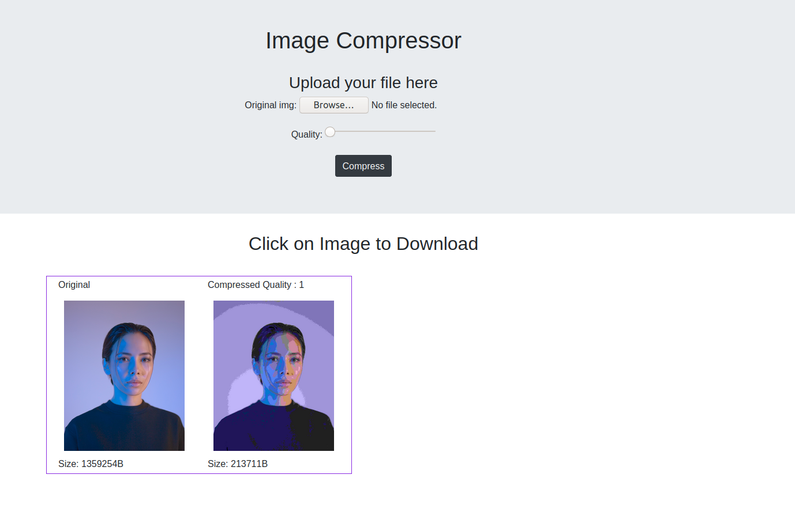

# Django-Image-compressor


<br>

## Description
Using PILLOW library converting RGB image to Gray image and compress the size of the image.

<br>

### Setup:

pip install pillow

python manage.py makemigrations

python manage.py migrate

python manage.py runserver

<br>

## Dockerfile
While in Dockerfile directory

```
docker build -t imagecompress .
```

Might take a bit, grab a cup of coffee.
After the image gets built you can start a container using the image
```
docker run -d -p 8000:8000 imagecompress
```